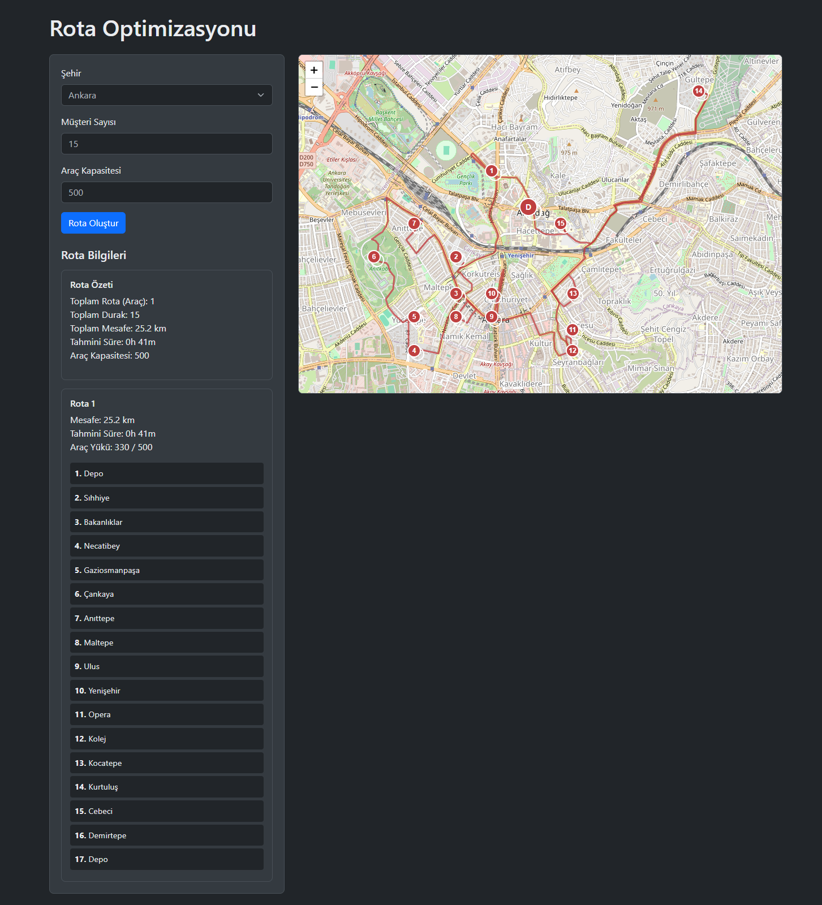

# Araç Rota Optimizasyonu

Tabu Arama algoritması kullanarak gerçek yol mesafelerine dayalı araç rota optimizasyonu yapan web uygulaması.

## Özellikler

- Gerçek yol mesafelerini kullanarak rota optimizasyonu (OpenStreetMap verileri)
- Araç kapasitesi kısıtlaması
- Çoklu araç desteği
- İnteraktif harita görselleştirmesi
- Rota detayları (mesafe, süre, duraklar)

## Örnek Kullanım

### Yüksek Kapasiteli Araç (500 birim)


Bu örnekte:
- Araç Kapasitesi: 500 birim
- Toplam Rota Sayısı: 1
- Toplam Mesafe: 25.2 km
- Tahmini Süre: 41 dakika
- Toplam Durak: 15 müşteri

### Düşük Kapasiteli Araç (150 birim)


Aynı müşteriler için düşük kapasiteli araç kullanıldığında:
- Araç Kapasitesi: 150 birim
- Toplam Rota Sayısı: 3
- Toplam Mesafe: 30.2 km
- Tahmini Süre: 41 dakika
- Toplam Durak: 15 müşteri

Bu örnekler, araç kapasitesinin rota planlaması üzerindeki etkisini göstermektedir. Düşük kapasiteli araç kullanıldığında, aynı müşterilere hizmet vermek için daha fazla rota oluşturulması gerekmektedir.

## Gereksinimler

- Python 3.8+
- Flask
- OSRM Sunucusu (yerel veya uzak)
- Modern web tarayıcısı

## Kurulum

1. Depoyu klonlayın:
```bash
git clone [repo-url]
```

2. Gerekli Python paketlerini yükleyin:
```bash
pip install -r requirements.txt
```

## Çalıştırma

1. OSRM sunucusunun çalıştığından emin olun

2. Flask uygulamasını başlatın:
```bash
python app.py
```

3. Web tarayıcısında açın:
```
http://localhost:5000
```

## Kullanım

1. Şehir seçin
2. Müşteri sayısını belirleyin (5-25 arası)
3. Araç kapasitesini ayarlayın
4. "Rota Oluştur" butonuna tıklayın
5. Optimizasyon sonuçlarını harita üzerinde görüntüleyin

## Veri Formatı

Şehir verileri `data` klasöründe aşağıdaki formatta tanımlanmalıdır:

```
SEHIR_ADI
VEHICLE
NUMBER     CAPACITY
25         500

CUSTOMER
CUST NO.  XCOORD.    YCOORD.    DEMAND   COMMENT
0         39.9334    32.8597    0        Depo
1         39.9220    32.8480    75       Müşteri 1
2         39.9150    32.8560    43       Müşteri 2
...
```

- `XCOORD` ve `YCOORD`: Enlem ve boylam koordinatları
- `DEMAND`: Müşteri talep miktarı (depo için 0)
- `COMMENT`: İsteğe bağlı açıklama

## Teknik Detaylar

- OSRM Table Service: Tüm noktalar arası mesafe matrisi hesaplama
- OSRM Route Service: Detaylı rota bilgisi ve görselleştirme
- Tabu Arama: Adaptif tabu listesi boyutu ve çeşitli komşuluk yapıları
- Paralel işleme ile performans optimizasyonu
